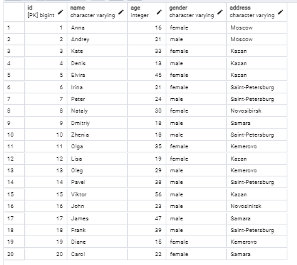

## 1

```sql
insert into person values (10, 'Zhenia', 18, 'male', 'Saint-Petersburg');
insert into person values (11, 'Olga', 35, 'female', 'Kemerovo');
insert into person values (12, 'Lisa', 19, 'female', 'Kazan');
insert into person values (13, 'Oleg', 29, 'male', 'Kemerovo');
insert into person values (14, 'Pavel', 38, 'male', 'Saint-Petersburg');
insert into person values (15, 'Viktor', 56, 'male', 'Kazan');
insert into person values (16, 'John', 23, 'male', 'Novosinirsk');
insert into person values (17, 'James', 47, 'male', 'Samara');
insert into person values (18, 'Frank', 39, 'male', 'Saint-Petersburg');
insert into person values (19, 'Diane', 15, 'female', 'Kemerovo');
insert into person values (20, 'Carol', 22, 'female', 'Samara');
```


```sql
insert into pizzeria values (7,'Pizzeria Stokey', 3.9);
insert into pizzeria values (8,'Voodoo Rays', 4.4);
insert into pizzeria values (9,'Zia Lucia', 5.0);
insert into pizzeria values (10,'Hai Cenato', 2.3);
insert into pizzeria values (11,'Princi', 4.0);
insert into pizzeria values (12,'Four Hundred Rabbits', 4.9);
insert into pizzeria values (13,'50 Kalo di Ciro Salvo', 3.7);
insert into pizzeria values (14,'Pizza Castle', 1.9);
insert into pizzeria values (15,'Quattro Pizza', 1.2);
insert into pizzeria values (16,'Ragazza', 3.2);
insert into pizzeria values (17,'Pizza Planet', 4.7);
```


```sql
insert into person_visits values (20, 17, 10, '2022-01-11');
insert into person_visits values (21, 17, 9, '2022-01-11');
insert into person_visits values (22, 12, 11, '2022-01-13');
insert into person_visits values (23, 11, 11, '2022-01-12');
insert into person_visits values (24, 17, 7, '2022-01-20');
insert into person_visits values (25, 15, 12, '2022-02-01');
insert into person_visits values (26, 12, 12, '2022-02-01');
insert into person_visits values (27, 17, 15, '2022-01-21');
insert into person_visits values (28, 9, 13, '2022-01-30');
insert into person_visits values (29, 8, 15, '2022-01-29');
insert into person_visits values (30, 7, 16, '2022-01-25');
```


```sql
insert into menu values (19,6,'cheese pizza', 700);
insert into menu values (20,6,'pepperoni pizza', 800);

insert into menu values (21,7,'cheese pizza', 700);
insert into menu values (23,7,'pepperoni pizza', 800);
insert into menu values (24,7,'sausage pizza', 950);

insert into menu values (25,8,'cheese pizza', 700);
insert into menu values (26,8,'mushroom pizza', 950);
insert into menu values (27,8,'sausage pizza', 950);

insert into menu values (28,9,'cheese pizza', 700);
insert into menu values (29,9,'supreme pizza', 1200);
```


```sql
insert into person_order values (21,10, 2, '2022-01-11');

insert into person_order values (22,11, 19, '2022-01-16');
insert into person_order values (23,11, 2, '2022-01-12');
insert into person_order values (24,11, 7, '2022-01-18');

insert into person_order values (25,12, 10, '2022-01-21');
insert into person_order values (26,12, 17, '2022-01-09');

insert into person_order values (27,13, 10, '2022-01-24');

insert into person_order values (28,14, 7, '2022-01-12');
insert into person_order values (29,14, 5, '2022-01-20');
insert into person_order values (30,14, 1, '2022-01-02');

insert into person_order values (31,15, 9, '2022-01-23');
```


## 2 

```sql
SELECT name, age, address
FROM person
WHERE address = 'Kemerovo';
```


## 3

```sql
SELECT  name, age, address, gender
FROM person
WHERE address = 'Kazan' AND gender = 'female'
ORDER BY name ASC;
```


## 4

```sql
SELECT name, rating
FROM pizzeria
WHERE rating >= 3.5 AND rating <= 5.0
ORDER BY rating DESC;
```


```sql
SELECT name, rating
FROM pizzeria
WHERE rating BETWEEN 3.5 AND 5.0
ORDER BY rating DESC;
```


## 5

```sql
SELECT DISTINCT ON (person_id) person_id, visit_date
FROM person_visits
WHERE visit_date >= '2022.01.11' AND visit_date <= '2022.01.31' OR person_id = 2
ORDER BY person_id DESC;
```


## 6


